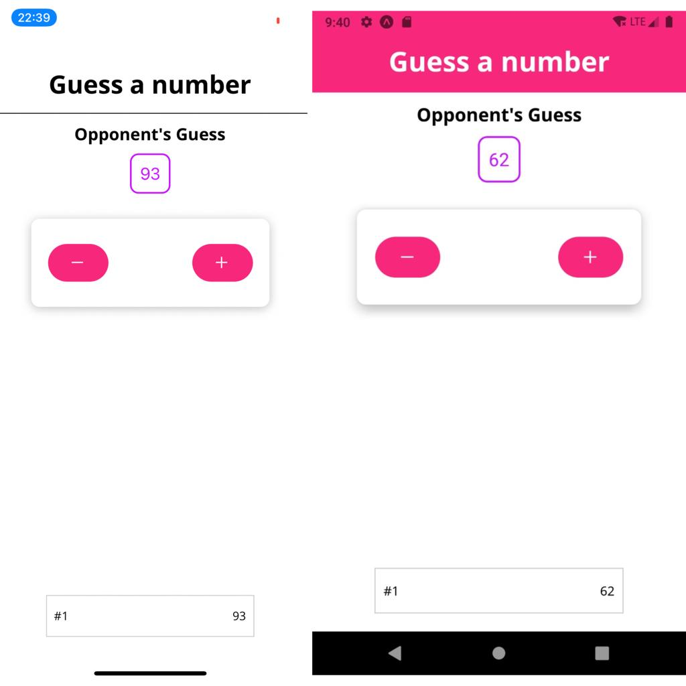

# Guess a number

### Installation

- run `npm install` or `yarn install`

### Run on Device

- run `yarn android` or `yarn ios` to run on device or emulator

### Project info

This project is simple example of a react native application just a practice
for a small game

#### ScreenShots - Native App

